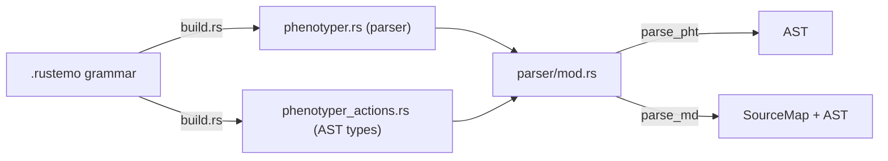

# M2 Walkthrough — Parser and AST

## Summary

Implemented a Rustemo-based parser for the Phenotyper v1 language. The parser successfully handles the full syntax (namespaces, uses, type aliases, enums, phenotype declarations with plural forms, field declarations, type expressions with cardinality/unions, render expressions with directives, block directives, and comments).

## Changes Made

### New Files

| File | Purpose |
|------|---------|
| [phenotyper.rustemo](file:///aivolution/projects/phenotyper/crates/phenotyper/src/parser/phenotyper.rustemo) | Rustemo grammar for Phenotyper v1 (152 lines) |
| [build.rs](file:///aivolution/projects/phenotyper/crates/phenotyper/build.rs) | Build script invoking `rustemo-compiler` |
| [parser/mod.rs](file:///aivolution/projects/phenotyper/crates/phenotyper/src/parser/mod.rs) | Parser wrapper with `parse_pht()` and `parse_md()` |
| [parser/phenotyper_actions.rs](file:///aivolution/projects/phenotyper/crates/phenotyper/src/parser/phenotyper_actions.rs) | Rustemo-generated AST types and actions |
| [parser/tests.rs](file:///aivolution/projects/phenotyper/crates/phenotyper/src/parser/tests.rs) | 22 parser tests |

### Modified Files

| File | Change |
|------|--------|
| [lexer/mod.rs](file:///aivolution/projects/phenotyper/crates/phenotyper/src/lexer/mod.rs) | Made `source_map` submodule public |
| [implementation_plan.md](file:///aivolution/projects/phenotyper/docs/tasks/implementation_plan.md) | Marked M2 tasks T-020 through T-031 as complete |

## Architecture



- **Grammar** → `OUT_DIR` (parser tables, regenerated each build)
- **Actions** → source tree (AST types, editable, committed)
- **Layout rule** handles whitespace + line/block comments

## Key Design Decisions

1. **Enum members**: Replaced `Ident+[Comma]` separator syntax with explicit recursive `EnumMembers` rule to avoid LR conflict with other `Ident` usages.
2. **Bare directives**: `@eol` (without parens) is a separate `BareDirective` production in `RenderExpr`, avoiding empty-production issues.
3. **Keyword terminals**: All keywords (`namespace`, `uses`, `type`, `required`, etc.) and primitives (`string`, `int64`, etc.) are explicitly defined in the `terminals` section.

## Test Results

```
running 44 tests
  22 lexer tests  — all pass
  22 parser tests — all pass
```

Parser tests cover: namespace, uses, type alias, enum, simple phenotype, plural, directives (field ref, call, bare eol, eol with args, block), cardinality (`+`/`*`), optional fields, string literals, union types, line/block comments, fixture files (csv_basic, optional_and_collections), markdown extraction, and negative tests (missing semicolon, empty input).
