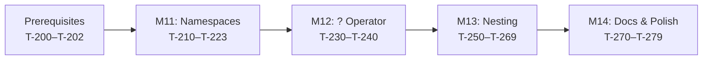

# Phenotyper v2 — Implementation Plan

## Overview

This plan implements the three v2 language enhancements defined in
[phenotyper_v2_language_and_compiler_spec.md](../design/phenotyper_v2_language_and_compiler_spec.md):

1. **Structural namespace syntax** — replace `namespace` keyword with `path:` ... `.`
2. **`?` suffix operator** — shorthand for `@ifset` / `@ifnotempty`
3. **Nested phenotype declarations** — phenotypes inside phenotypes with parent-scoped field access

The implementation follows the v2 spec's suggested order: namespaces first (foundational),
then `?` operator (self-contained), then nesting (most complex).

### Baseline

- **v1 tag:** `v0.1.0` — 219 tests, 10 milestones complete
- **Crate structure:** `phenotyper-core` (library) + `phenotyper-cli` (binary)
- **Parser:** Rustemo LR(1) — will switch to GLR for v2

---

## Prerequisites

- [x] **T-200**: Review Rustemo GLR documentation and confirm API for enabling GLR mode.
- [x] **T-201**: Verify Rustemo GLR handles the `Ident ':'` fork/prune pattern with a minimal prototype.
- [x] **T-202**: Update existing v1 fixture files and examples to serve as regression baselines.

---

## Milestone 11 — Structural Namespace Syntax

**Goal:** Replace `namespace path;` with `path:` ... `.` using GLR parsing.

**Spec reference:** §1.1–§1.7

### Phase 1: Grammar & Parser

- [x] **T-210**: Switch Rustemo parser mode from LR(1) to GLR in `build.rs` configuration.
- [x] **T-211**: Update `phenotyper.rustemo` grammar:
  - Replace `File: ns=NamespaceDecl ...` with `File: ns=NamespaceScope | decls=TopLevelDecl+;`
  - Add `NamespaceScope: path=NamespacePath ':' uses=UsesDecl* decls=TopLevelDecl* '.';`
  - Remove `NamespaceDecl: 'namespace' path=NamespacePath ';';`
  - Add `.` as `Dot` terminal.
  - Remove `namespace` from reserved keywords.
- [x] **T-212**: Update `phenotyper_actions.rs` — adapt AST builder actions for the new
  `File` and `NamespaceScope` productions.
- [x] **T-213**: Add parser unit tests for:
  - Multi-segment namespace: `aivolution/format/csv: ... .`
  - Single-segment namespace: `csv: ... .` (GLR disambiguation)
  - Namespace with `uses` declarations
  - Empty namespace: `csv: .`
  - Missing `.` terminator (error recovery)

### Phase 2: AST & IR

- [x] **T-214**: Update `ast.rs` — adapt `File` AST node to carry `NamespaceScope`
  or bare declarations.
- [x] **T-215**: Update `ir/lower.rs` — adapt IR lowering to extract namespace path
  from the new AST shape.
- [x] **T-216**: Update `symbol/collect.rs` and `symbol/resolve.rs` — adapt symbol
  table to the new namespace extraction.

### Phase 3: Markdown Container

- [x] **T-217**: Update `lexer/source_map.rs` — the markdown extractor must append
  an implicit `.` token at the end of extracted blocks (with synthetic span).
- [x] **T-218**: Add parser tests for `.md` containers without trailing `.` block.

### Phase 4: Migration & Compatibility

- [ ] **T-219**: Implement `phenotyper migrate` CLI subcommand (deferred to M14).
- [x] **T-220**: Migrate all existing fixture files and examples to v2 syntax.
- [x] **T-221**: Update e2e and CLI tests for v2 namespace syntax.

### Phase 5: Cleanup

- [x] **T-222**: Remove `namespace` keyword from lexer reserved words and token enum.
- [x] **T-223**: Run full test suite — confirm all tests pass with new syntax.

**Requirements covered:** v2 spec §1

---

## Milestone 12 — `?` Suffix Operator

**Goal:** Add `@(field)?` and `@join(field, sep)?` as sugar for conditional rendering.

**Spec reference:** §3.1–§3.9

### Phase 1: Grammar & Parser

- [x] **T-230**: Update `phenotyper.rustemo` grammar:
  - Add `'?'` as `Question` terminal.
  - Add `ConditionalRef` production: `'@' '(' FieldPath ')' '?' BlockBody?`
  - Add `ConditionalDirective` production: `'@' Ident DirectiveSuffix '?' BlockBody?`
- [x] **T-231**: Update `phenotyper_actions.rs` — build `ConditionalRef` and
  `ConditionalDirective` AST nodes.
- [x] **T-232**: Add parser unit tests for:
  - `@(field)?` — bare conditional field ref
  - `@(field)? { "prefix: ", @(field) }` — block conditional
  - `@join(tags, ", ")?` — conditional join (bare)
  - `@join(tags, ", ")? { "Tags: ", @join(tags, ", ") }` — conditional join (block)
  - `@(field)?` on required field (should parse, warning at semantic phase)

### Phase 2: AST & IR

- [x] **T-233**: Update `ast.rs` — add `ConditionalRef` and `ConditionalDirective`
  to the `RenderExpr` enum.
- [x] **T-234**: Update `ir/lower.rs` — desugar `?` to existing IR nodes:
  - `@(field)?` on `optional` → `IfSet { field, body: [FieldRef(field)] }`
  - `@(field)? { body }` on `optional` → `IfSet { field, body }`
  - `@(field)?` on collection → `IfNotEmpty { field, body: [FieldRef(field)] }`
  - `@(field)? { body }` on collection → `IfNotEmpty { field, body }`
  - `@join(f, s)?` → `IfNotEmpty { f, body: [Join(f, s)] }`
- [x] **T-235**: Add IR lowering tests for all desugaring cases.

### Phase 3: Semantic Validation

- [x] **T-236**: Update `semantic/validate.rs` — emit warning diagnostic for:
  - `?` on a `required` field (always present — redundant)
  - `?` on a `+` cardinality collection (never empty — redundant)
- [x] **T-237**: Add semantic validation tests for the warning cases.

### Phase 4: Integration

- [x] **T-238**: No codegen changes needed — desugaring happens at IR level, existing
  `IfSet`/`IfNotEmpty` codegen handles all cases.
- [x] **T-239**: Add e2e tests with `?` operator in fixture files.
- [x] **T-240**: Add CLI test for `check` with `?` operator warnings.

**Requirements covered:** v2 spec §3

---

## Milestone 13 — Nested Phenotype Declarations

**Goal:** Allow phenotype definitions inside phenotype bodies, with parent-scoped field access.

**Spec reference:** §2.1–§2.9

### Phase 1: Grammar & Parser

- [x] **T-250**: Update `phenotyper.rustemo` grammar:
  - Add `nested=TypeDef {NestedType}` to `BodyItem` production.
  - Extend `FieldPath` to support multi-segment paths: `segments=Ident+[Slash]`.
  - Update `FieldRef` to use `FieldPath` instead of bare `Ident`.
- [x] **T-251**: Update `phenotyper_actions.rs` — build `NestedType` body items
  and multi-segment `FieldPath` nodes.
- [x] **T-252**: Add parser unit tests for:
  - Phenotype nested inside phenotype
  - Two levels of nesting
  - `@(Parent/field)` scoped field reference
  - Nested phenotype with `plural` clause
  - Mixed body: fields, nested phenotypes, render expressions

### Phase 2: AST

- [x] **T-253**: Update `ast.rs`:
  - Add `NestedType(TypeDef)` variant to `BodyItem`.
  - Change `FieldRef` to carry `Vec<String>` segments instead of single `String`.
- [x] **T-254**: Add AST unit tests for nested structures.

### Phase 3: Symbol Table

- [x] **T-255**: Update `symbol/collect.rs` — collect nested phenotype declarations:
  - Walk `BodyItem::NestedType` recursively.
  - Record parent–child relationship in a new `ScopeTree` or equivalent.
  - Nested phenotype names are scoped to their parent (not visible at namespace level).
- [x] **T-256**: Update `symbol/resolve.rs` — resolve scoped field paths:
  - `@(name)` → search current scope, then parent, then namespace.
  - `@(Parent/field)` → resolve `Parent` as a containing phenotype, then `field` in it.
  - Emit error if `Parent` is not a containing phenotype.
- [x] **T-257**: Add symbol table tests for:
  - Nested phenotype name scoping (visible inside parent, invisible outside)
  - Scoped field path resolution `@(Parent/field)`
  - Shadowing: nested field with same name as parent field
  - Error: referencing a non-containing phenotype in scope path

### Phase 4: IR & Semantic Validation

- [x] **T-258**: Update `ir/lower.rs` — lower nested phenotypes:
  - Flatten nested `TypeDef` into the module's type list (flat IR).
  - Record parent context reference for render expressions that use `@(Parent/field)`.
  - Lower `FieldPath` segments to `ScopedFieldRef { scope: Option<String>, field: String }`.
- [x] **T-259**: Update `ir/mod.rs` — add `parent_context: Option<String>` to
  `PhenotypeIr` for nested phenotypes that reference parent fields.
- [x] **T-260**: Update `semantic/validate.rs`:
  - Validate that `@(Parent/field)` references resolve to real parent fields.
  - Validate nesting depth (warning at > 3 levels).
  - Validate that nested phenotype names don't collide with namespace-level names.
- [x] **T-261**: Add semantic validation tests for all nesting error cases.

### Phase 5: Code Generation

- [x] **T-262**: Update `codegen/emit.rs` — generate `render_with_parent` method:
  - Nested phenotypes that reference parent fields generate
    `fn render_with_parent(&self, parent: &ParentType, out: &mut String)`.
  - Nested phenotypes without parent references generate normal `render_into`.
- [x] **T-263**: Update `codegen/emit.rs` — parent render body calls `render_with_parent`:
  - When the containing phenotype renders a nested child, it passes `&self` as parent.
- [x] **T-264**: Update `codegen/naming.rs` — nested phenotype naming:
  - Nested phenotypes generate flat Rust types with their DSL name.
  - If a name collision with a namespace-level type is detected, emit a compile error
    (not a prefix-mangled name — keep generated code predictable).
- [x] **T-265**: Add codegen unit tests for:
  - Nested phenotype generates flat struct
  - `render_with_parent` signature and body
  - Parent `render_into` calls `render_with_parent(self, out)`
  - Nested phenotype with plural wrapper

### Phase 6: Integration

- [x] **T-266**: Create `tests/fixtures/valid/nested_basic.pht` — minimal nesting test.
- [x] **T-267**: Create `tests/fixtures/valid/javaclass.pht` — v2 translation of
  `docs/examples/javaclass.md` as a comprehensive nesting fixture.
- [x] **T-268**: Add e2e tests: parse → compile → `rustc` → runtime verify for
  nested phenotypes.
- [x] **T-269**: Add CLI integration tests for nested phenotype files.

**Requirements covered:** v2 spec §2

---

## Milestone 14 — Documentation & Polish

**Goal:** Update all documentation for v2, run quality checks.

### Documentation

- [ ] **T-270**: Update `docs/howto/authoring_phenotypes.md` — add v2 syntax
  (structural namespaces, nesting, `?` operator).
- [ ] **T-271**: Update `docs/howto/using_generated_code.md` — add
  `render_with_parent` API for nested phenotypes.
- [ ] **T-272**: Update `docs/howto/compiler_usage.md` — add `migrate` subcommand.
- [ ] **T-273**: Update `docs/howto/build_rs_integration.md` — v2 syntax examples.
- [ ] **T-274**: Update `README.md` — v2 feature summary, updated examples.
- [ ] **T-275**: Update v2 examples — ensure `docs/examples/` use v2 syntax:
  - `csv.md` / `csv.pht`
  - `prompt.md`
  - `config.md`
  - `report.md`
  - `javaclass.md` (updated to normative v2)

### Quality

- [ ] **T-276**: Run `cargo clippy` — clean all warnings.
- [ ] **T-277**: Run full test suite — all tests pass.
- [ ] **T-278**: Bump version to `0.2.0` in all `Cargo.toml` files.
- [ ] **T-279**: Tag `v0.2.0` release.

**Requirements covered:** Cross-cutting.

---

## Summary

| Milestone | Feature | Tasks | Est. Effort |
|-----------|---------|-------|-------------|
| M11 | Structural namespace syntax | T-210 – T-223 (14 tasks) | 3–4 days |
| M12 | `?` suffix operator | T-230 – T-240 (11 tasks) | 2–3 days |
| M13 | Nested phenotypes | T-250 – T-269 (20 tasks) | 5–7 days |
| M14 | Documentation & polish | T-270 – T-279 (10 tasks) | 2–3 days |
| **Total** | | **55 tasks + 3 prerequisites** | **12–17 days** |

### Dependency Graph

M12 (`?` operator) could technically be done in parallel with M11, but
sequencing after M11 avoids working against a moving grammar. M13 depends
on M11 for the `FieldPath` grammar extension and GLR infrastructure.
